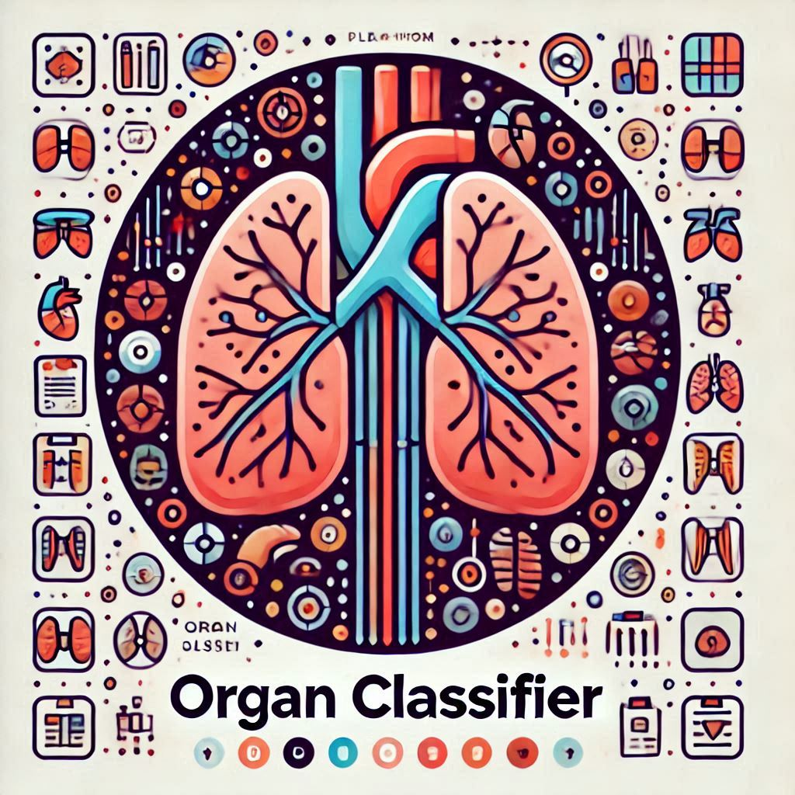
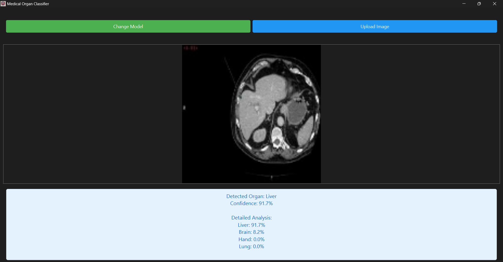
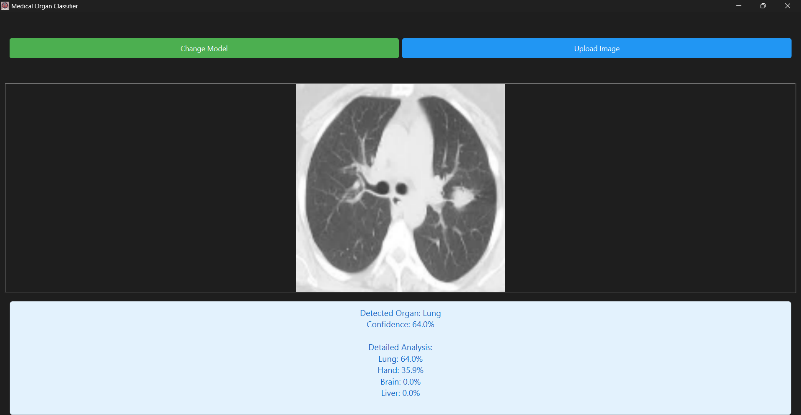
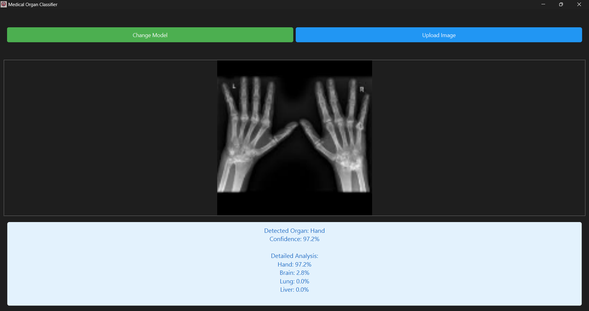
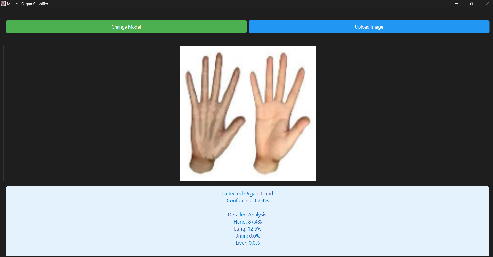

# Medical Organ Classifier

The **Medical Organ Classifier** is a cutting-edge AI-powered application designed to classify medical organ images with precision and ease. Leveraging advanced deep learning models, this tool delivers accurate predictions with confidence scores, all through an intuitive graphical interface. Built with TensorFlow/Keras, it offers flexibility for customization and expansion.

---



---

## Key Features

### **Interactive GUI**
- Load and utilize pre-trained TensorFlow/Keras models.
- Upload medical images and receive predictions with detailed confidence scores.
- User-friendly interface for seamless interaction.

### **Dynamic Classification**
- Supports classification of multiple organs, including:
  - Brain
  - Hand
  - Liver
  - Lung
- Delivers results with confidence levels to ensure reliability.

### **Customizable and Scalable**
- Easily extend functionality by adding new organ classes.
- Simply update the model and its corresponding JSON label file to support additional categories.

---

## Model Demonstration

### Example Trials:

#### Liver Image Classification:


#### Lung Image Classification:


#### Hand X-Ray Image Classification:


#### Normal Hand Image Classification :


---

## Deep Learning Model

### **Model Overview**
- Powered by a TensorFlow/Keras pre-trained model.
- Outputs classes based on a JSON label file (e.g., `organ_model.json`).
- Example JSON format for classification labels:
  ```json
  ["Brain", "Hand", "Liver", "Lung"]
  ```

### **Training a New Model**
1. Open the `Training_notebook.ipynb` in the `training/` directory.
2. Prepare your dataset and follow the steps outlined in the notebook.
3. Save the trained model as `organ_model.h5`.
4. Update the `organ_model.json` file to match the output classes of the new model.

---

## Installation Guide

### **Prerequisites**
- **Python:** Version 3.8 or higher.
- **Git:** To clone the repository.

### **Steps to Install**

1. **Clone the Repository**
   ```bash
   git clone https://github.com/yourusername/MedicalOrganClassifier.git
   cd MedicalOrganClassifier
   ```

2. **Install Dependencies**
   ```bash
   pip install -r requirements.txt
   ```

3. **Place the Model Files**
   - Add the pre-trained model file (e.g., `organ_model.h5`) to the `models/` directory.
   - Ensure the `organ_model.json` file matches the class labels for the model and is placed in the `app/` directory.

4. **Run the Application**
   ```bash
   python app/main.py
   ```

---

## Important Notes

### **File Compatibility**
- The model file (e.g., `organ_model.h5`) and label file (`organ_model.json`) must correspond.
- Ensure the number of classes in the model matches the labels in the JSON file.

### **Common Issues**
- **Error During Prediction:** Ensure the model and JSON file are compatible.
- **Verification:** Use the "Load Model" feature in the app to confirm compatibility.

---

## Contributing

We welcome contributions to enhance this project! To contribute:

1. Fork the repository.
2. Create a feature branch.
3. Submit a pull request with detailed information about your changes.

---

## License

This project is licensed under the **MIT License**. Refer to the `LICENSE` file for more details.

---

## Team Members

This project was developed collaboratively by a dedicated team:

- [**Sief Eldin Sameh**](https://github.com/SiefEldinSameh)
- [**Fahd Ahmed**](https://github.com/fahdahmed10)
- [**Ahmed Salem**](https://github.com/Ahmedo0oSalem)  
- [**Karim Farid**](https://github.com/eslamFared)

